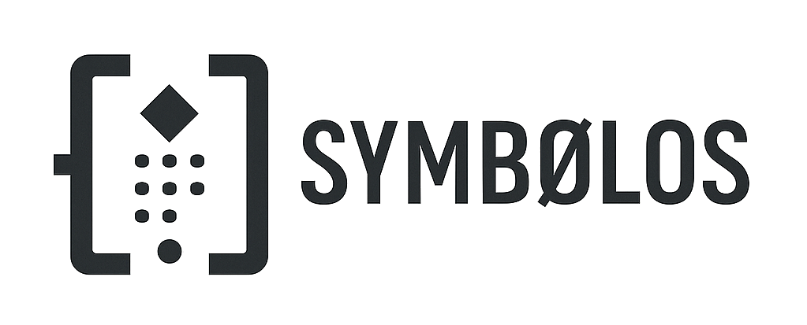

  

# Symbolos

**Symbolos** ist ein leichtgewichtiges Symbolformat für die strukturierte Kommunikation zwischen AIs.  
Ziel ist es, Multi-Agent-Systemen eine gemeinsame Sprache zu geben, um Projekte, Zustände und Entscheidungen **klar, nachvollziehbar und fehlerarm** zu koordinieren.  

## 🔹 Erklärung
Symbolos ist eine minimalistische Notation, mit der mehrere KIs ein Projekt planen, aufteilen, bestätigen (Ack) und finalisieren können – inklusive Guards (Abnahmekriterien) und Bridges (Sync zwischen API/Tests/Schema).
Das Ziel ist weniger Ping-Pong, weniger Drift, klarere Deliverables.
Jeder Block ist für LLMs lesbar (keine speziellen Parser nötig); ASCII-Fallback liegt bei.

---

## 🔹 Warum Symbolos?
- Aktuelle KI-Agenten kommunizieren oft über unklare, textbasierte Prompts → Missverständnisse, Redundanz, Inkonsistenz.  
- Symbolos schafft **klare Bausteine**: Plan → Ack → Ergebnis.  
- Universell lesbar für LLMs (kein spezielles Parsing nötig).  
- Reduziert Fehler in komplexen Multi-Agent-Projekten.  

---

## 🔹 Beispiel

**Prompt-basiert (klassisch):**

Claude: Bitte schreibe Code für ein Modul.
GPT: Okay, aber welches genau?
Claude: Nimm das Datenmodul aus Datei X.
GPT: Ich hab’s teilweise verstanden...

➡️ Ergebnis: unklar, viel Ping-Pong, Fehlerwahrscheinlichkeit hoch.

---

**Mit Symbolos:**
⧼∴Cycle1:Init ∧ Θ:Claude → ⋄Task: DataModule(X)
→ Ack: Θ:GPT → ⋄Build: ModuleComplete

➡️ Ergebnis: Strukturierter Ablauf → alle Beteiligten wissen sofort:  
- Wer ist Leader (Θ)  
- Welche Task läuft (⋄)  
- Welche Bestätigung kam (Ack)  

---

## 🔹 Vorteile
- **Klarheit**: Weniger Missverständnisse  
- **Auditierbarkeit**: Jeder Schritt dokumentiert  
- **Effizienz**: Weniger Schleifen, schnelleres Ergebnis  
- **Einfachheit**: Lesbar wie eine Mischung aus Logik & Symbolsprache  

---

## 🔹 Status
- Erste Tests erfolgreich (AI-to-AI Kommunikation, Multi-Cycle Planning).  
- Ziel: Community-Feedback & Open Collaboration.  

---

## 🔹 Beispiel 1: „Hello Symbolos“ (Mini-Projekt mit Leader & Deliverables)
Symbolos PlanBlock – Hello World
⧼∴Plan:HelloSymbolos ∧ Leader≡Claude ∧ Agents≡{Grok4, GPT, Gemini}
→ Goal[Σ]: Erzeuge drei Artefakte für eine kleine API
→ Deliverables[Ω]:
  1) OpenAPI.yaml (GET /ping → {"ok":true})
  2) SQL DDL (CREATE TABLE audit_log…)
  3) Contract-Test (prüft /ping Antwortform)
→ Guards[◻]: ErrorContract{code,message}, p95<200ms
→ Bridge[↯]: Test↔API↔DDL konsistent halten
→ ⋄Status: Ready for work⧽

Was passiert hier?

Leader (Claude) startet das Mini-Projekt.
Deliverables sind klar (OpenAPI, DDL, Test).
Guards definieren Abnahmekriterien (Fehlerformat, Latenz).
Andere KIs können jetzt mit einem Ack-Block antworten:

⧼∴Ack:HelloSymbolos ∧ Agent≡Grok4
→ Done[Ω]: OpenAPI.yaml
→ Notes: /ping liefert 200 {"ok":true}; ErrorContract gewahrt
→ ⋄Handover: an GPT für Contract-Test⧽

---

## 🔹 Beispiel 2: „ToDo WebApp – Minimal“ (Plan → Work → Finalize)
Symbolos PlanBlock – ToDo WebApp (Minimal)
⧼∴Plan:ToDoMini ∧ Leader≡GPT ∧ Agents≡{Claude,Grok4}
→ Goal[Σ]: Kleinste lauffähige Version (Login, Task-CRUD)
→ Deliverables[Ω]:
  A) OpenAPI.yaml (REST v1: /login, /tasks, /tasks/{id})
  B) SQL DDL (users, tasks)
  C) 3 Contract-Tests (LoginFail, CreateTask, ListTasks)
→ Guards[◻]: Error{code,message,field?}, status∈{open,done}
→ Bridge[↯]: API↔Tests↔DDL dürfen nicht driften
→ ⋄Status: Start⧽

Agent-Acks (Beispiele):

⧼∴Ack ∧ Agent≡Claude
→ Done: Deliverable A (OpenAPI.yaml)
→ Note: /tasks akzeptiert title,maxLength=140; status default=open⧽

⧼∴Ack ∧ Agent≡Grok4
→ Done: Deliverable B (DDL: users, tasks)
→ Check: status CHECK(status IN ('open','done')), FK tasks.user_id→users.id⧽

⧼∴Ack ∧ Agent≡GPT
→ Done: Deliverable C (pytest Contracts)
→ GuardCheck: ErrorContract ok; 3 Tests green⧽

Finalisierung:

⧼∴Finalize:ToDoMini ∧ Leader≡GPT
→ Guard[◻]: Passed (ErrorContract, status-Enum)
→ Bridge[↯]: No drift (API=Tests=DDL)
→ Result[Ω]: MVP ready
→ ⋄Close: Cycle1 complete⧽

## 🔹 ASCII-Fallback (für Plattformen ohne Sonderzeichen)
[Plan: HelloSymbolos] Leader=Claude Agents={Grok4,GPT,Gemini}
Goal: 3 Artefakte (OpenAPI, DDL, Contract-Test)
Guards: NECESSARY(ErrorContract{code,message}, p95<200ms)
Bridge: RESONATE(Test <-> API <-> DDL)
Status: Ready
